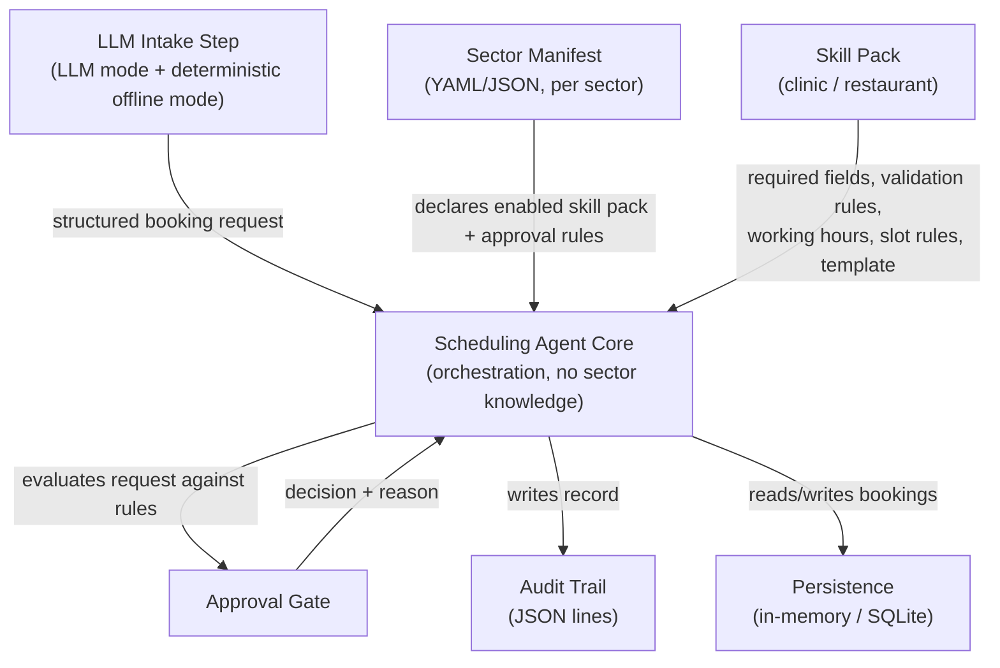
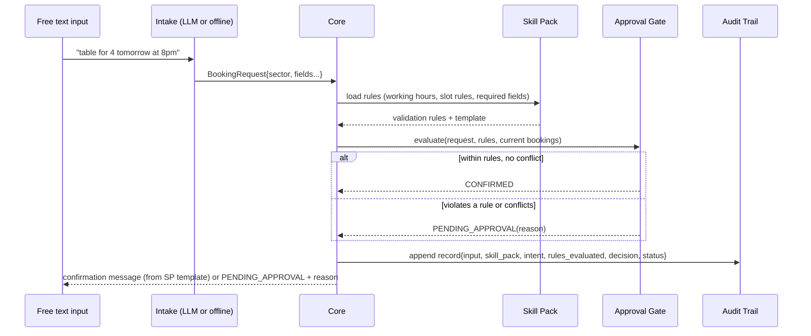

# ARCHITECTURE.md

This is the document the implementation is held against — both by the R1-proof test (`PLAN.md` T11) and in the live interview's extension exercise. Every claim here about what a sector may/must-not touch should be true of the actual code at submission time.

> For a deeper, three-level walkthrough (activity → sequence → class) that expands on the diagrams below, see [`diagrams/DIAGRAMS.md`](diagrams/DIAGRAMS.md). The class diagram there is the one the implementation is written against line-for-line.

## 1. Component diagram



**Dependency direction is one-way**: `SkillPack` and `Manifest` are read *by* the Core; the Core never imports or names a specific skill pack. `Gate`, `Audit`, and `Store` are owned by the Core and have no sector awareness of their own — they operate purely on the generic `BookingRequest` / `Decision` types.

Sector-naming knowledge (which concrete `SkillPack` class backs each
manifest's `skill_pack` string) lives in `eais_scheduling_agent/wiring.py`,
shared by both entry points (`cli.py`, and the optional `http_api.py`) --
neither entry point defines this mapping independently.

## 2. Sequence diagram — one booking request end to end

_A version of this diagram with all six components named and the LLM/offline branch shown is in [`diagrams/sequence-diagram.mmd`](diagrams/sequence-diagram.mmd) / [`diagrams/DIAGRAMS.md`](diagrams/DIAGRAMS.md#2-one-level-deeper--sequence-diagram-behaviour)._



## 3. Extension point map

What a **new sector** must add — and, just as importantly, must never need to touch:

| Layer | New sector touches it? | Detail |
|---|---|---|
| `manifests/<sector>.yaml` | **Yes — adds one** | New manifest file declaring the skill pack, enabled agent, approval rules |
| `skillpacks/<sector>/` | **Yes — adds one** | New skill pack module/config implementing the skill-pack interface |
| `core/` (orchestration, gate, audit, persistence) | **No — must not touch** | Zero sector-named identifiers, imports, or constants (R1); this is what the R1-proof test checks |
| `intake/` (LLM + offline) | **No, in the common case** | Intake produces a sector-tagged generic structure; a new sector should not require new intake code unless its vocabulary is wildly different (documented as a `DESIGN.md` trade-off if so) |
| `tests/` | **Yes — adds sector-specific tests** | New tests for the new skill pack; existing core tests must keep passing unmodified |

This table *is* the contract used in the live interview's third-sector extension exercise: if adding a sector requires editing anything in the "must not touch" row, the design has failed its own central claim.

## 4. Data contracts

### Sector manifest (per sector)

```yaml
sector: clinic
enabled: true
skill_pack: clinic_v1
approval_required_for:
  - outside_working_hours
  - double_booking
  - missing_required_field
```

| Field | Meaning |
|---|---|
| `sector` | Identifier tag attached to every request/audit record for this sector — used for reporting only, never branched on in the core |
| `enabled` | Whether this sector's agent is active at all |
| `skill_pack` | Which skill pack implementation to load for this sector |
| `approval_required_for` | Which rule categories force `PENDING_APPROVAL` rather than being silently auto-corrected |

### Skill pack interface

| Field | Meaning |
|---|---|
| `required_fields` | Fields a booking request must contain for this sector (e.g. clinic: `practitioner`, `patient_name`; restaurant: `party_size`) |
| `validation_rules` | Callable(s) checking sector-specific constraints (e.g. clinic: fixed slot length per practitioner; restaurant: capacity vs. party size) |
| `working_hours` | When bookings are permitted at all |
| `slot_rules` | How duration/capacity is computed — fixed-length-per-practitioner (clinic) vs. flexible-duration-by-party-size (restaurant) |
| `confirmation_template` | Message template rendered on a `CONFIRMED` decision |

The core depends only on this interface shape — never on which concrete skill pack is loaded.
