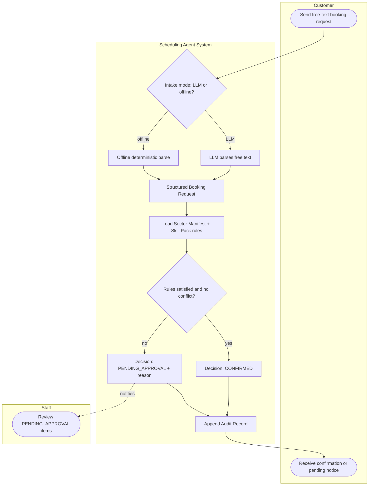
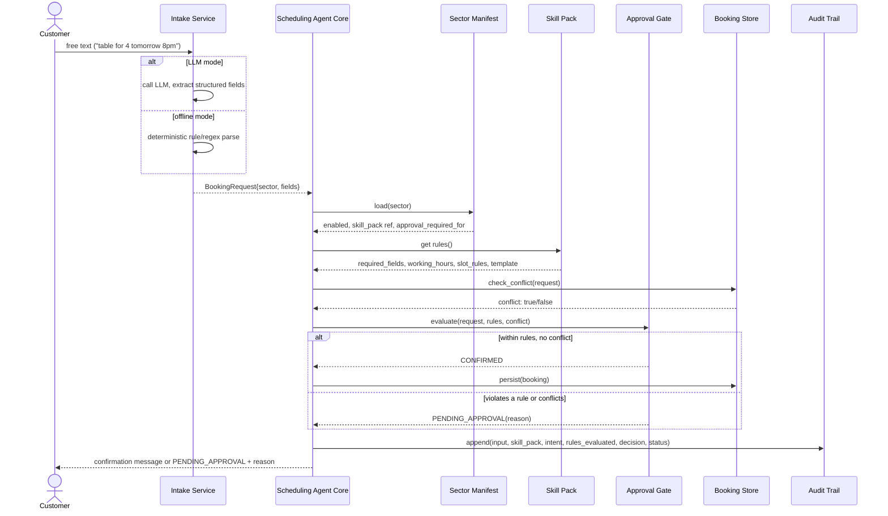
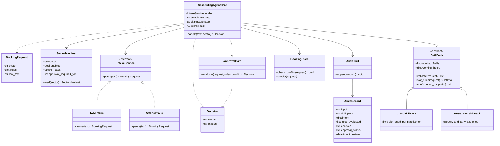

# UML Diagrams — Scheduling Agent Core

This package walks through the design at three levels of altitude, each one step closer to the code: the **activity diagram** shows the broad business process a booking request goes through, the **sequence diagram** shows the same journey as concrete component-to-component behaviour, and the **class diagram** shows the actual objects that behaviour is implemented with. Read in this order — each diagram answers "how does what I just saw actually happen?"

Sources (`.mmd`, Mermaid) live alongside this file and render natively in any Mermaid-aware viewer, including directly on GitHub. `UML_Diagrams.docx` in this same folder is an exported, standalone copy of this walkthrough with rendered images, for sharing outside the repo (e.g. printing, or reading before an interview without cloning anything).

This package expands on — and is referenced from — [`../PLAN.md`](../PLAN.md) and [`../ARCHITECTURE.md`](../ARCHITECTURE.md). It does not replace the component diagram or data contracts in `ARCHITECTURE.md`; it goes one level deeper into *behaviour* and *object structure*.

---

## 1. The broad picture — Activity Diagram

Source: [`activity-diagram.mmd`](activity-diagram.mmd)

**What this shows:** the end-to-end business process, independent of which classes or functions implement it. Three swimlanes — Customer, the Scheduling Agent System, and Staff — make clear who does what. Deliberately, this diagram does not distinguish clinic from restaurant: at this altitude, **both sectors are the same process**. That sameness is the whole point of the design (FR1 / R1) — sector differences only enter at "Load Sector Manifest + Skill Pack rules," as *data*, not as a fork in the process itself.

**Why it comes first:** before looking at which components talk to which, it's worth confirming the shape of the process a non-engineer (a stakeholder, an interviewer skimming the submission) would recognise: send a request, get parsed, get checked against rules, get confirmed or held for review, get logged either way.

---

## 2. One level deeper — Sequence Diagram (behaviour)

Source: [`sequence-diagram.mmd`](sequence-diagram.mmd)

**What this shows:** the same journey as the activity diagram, but now as concrete messages between named components — the ones that appear in the class diagram below. Every box in the activity diagram's "System" swimlane corresponds to one or more of these calls:

| Activity diagram step | Sequence diagram participant(s) |
|---|---|
| "LLM parses" / "Offline deterministic parse" | `Intake Service` |
| "Load Sector Manifest + Skill Pack rules" | `Sector Manifest`, `Skill Pack` |
| "Rules satisfied and no conflict?" | `Booking Store` (conflict check) + `Approval Gate` (rule evaluation) |
| "Append Audit Record" | `Audit Trail` |

**What's new at this level:** the `Scheduling Agent Core` is now visibly the *only* participant that talks to every other component — `Intake Service`, `Sector Manifest`, `Skill Pack`, `Approval Gate`, `Booking Store`, and `Audit Trail` never talk to each other directly. That star topology, not just "no sector names in the core," is what makes FR1 hold structurally rather than by convention.

---

## 3. Into the architecture — Class Diagram

Source: [`class-diagram.mmd`](class-diagram.mmd)

**What this shows:** the two abstraction boundaries the whole design rests on:

- **`SkillPack`** is abstract; `SchedulingAgentCore` depends only on that abstraction, never on `ClinicSkillPack` or `RestaurantSkillPack` by name. Adding a third sector means writing a third subclass — zero changes to `SchedulingAgentCore`. This is FR1 and the extension-point map in `ARCHITECTURE.md`, expressed as a class relationship rather than a rule.
- **`IntakeService`** is an interface with two interchangeable implementations, `LLMIntake` and `OfflineIntake`. `SchedulingAgentCore` is written against the interface, so the deterministic-offline requirement (FR4) is satisfied by *swapping an implementation*, not by branching inside the core on "are we in test mode."

**Why it comes last:** this is the diagram the implementation is written against line-for-line, and the one the live interview's extension exercise will probe directly — "show me the third subclass, show me it required no core changes." The activity and sequence diagrams above are what make that class structure legible as a business process and a runtime behaviour, rather than an abstraction for its own sake.
